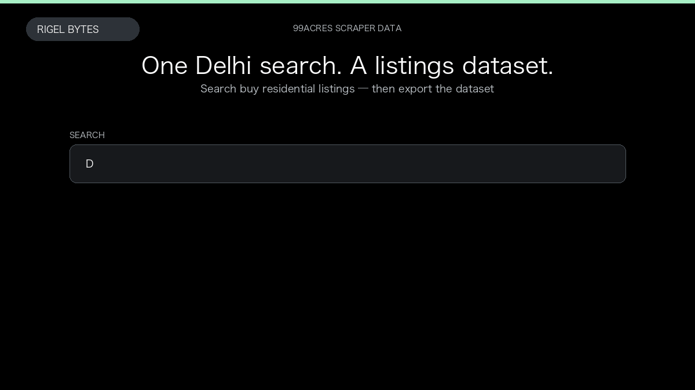

# 99acres Scraper

**99acres Scraper** is an Apify Actor by Rigel Bytes for 99acres.com data.

This folder hosts the public demo GIF used on the Actor README. The scraper itself runs on Apify Store — not in this repository.

**[99acres Scraper on Apify](https://apify.com/rigelbytes/99acres-scraper)**

## What this 99acres.com scraper does

Extract 99acres.com property listings, prices, amenities, and seller contacts for Indian real estate research and lead generation.

Use it as a 99acres.com scraper to extract structured data and export CSV, JSON, Excel, or XML from Apify.

## Start here

1. Open [99acres Scraper](https://apify.com/rigelbytes/99acres-scraper) on Apify Store.
2. Paste your 99acres.com URLs, queries, or other documented inputs.
3. Click **Start** and export JSON, CSV, Excel, or XML.

If you found this GitHub page while looking for a 99acres.com scraper, use the Apify link above to run it.
