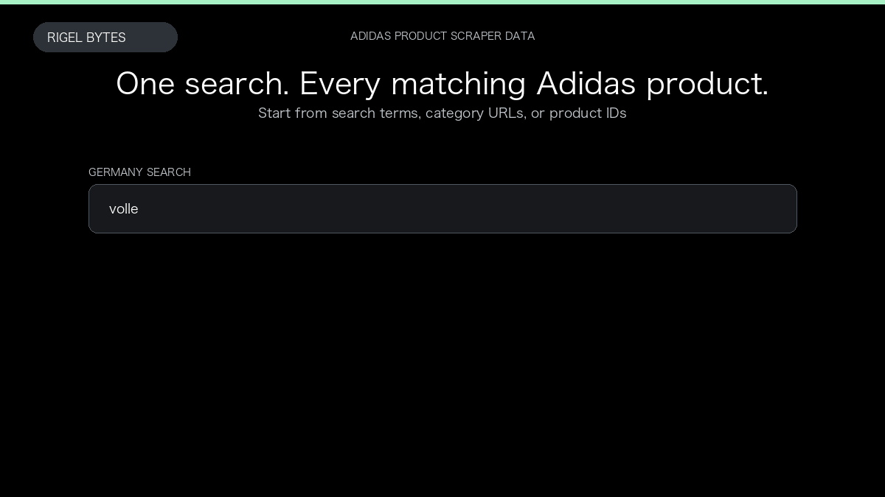

# Adidas Product Scraper

**Adidas Product Scraper** is an Apify Actor by Rigel Bytes for Adidas data.

This folder hosts the public demo GIF used on the Actor README. The scraper itself runs on Apify Store — not in this repository.

**[Adidas Product Scraper on Apify](https://apify.com/rigelbytes/adidas-scraper)**

## What this Adidas scraper does

Scrape Adidas product listings from 33 country storefronts by search, category URL, or product ID. Export prices, images, and optional full product details.

Use it as a Adidas scraper to extract structured data and export CSV, JSON, Excel, or XML from Apify.

## Start here

1. Open [Adidas Product Scraper](https://apify.com/rigelbytes/adidas-scraper) on Apify Store.
2. Paste your Adidas URLs, queries, or other documented inputs.
3. Click **Start** and export JSON, CSV, Excel, or XML.

If you found this GitHub page while looking for a Adidas scraper, use the Apify link above to run it.
