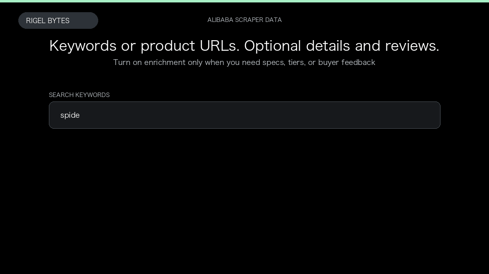

# Alibaba Scraper

**Alibaba Scraper** is an Apify Actor by Rigel Bytes for Alibaba.com data.

This folder hosts the public demo GIF used on the Actor README. The scraper itself runs on Apify Store — not in this repository.

**[Alibaba Scraper on Apify](https://apify.com/rigelbytes/alibaba-scraper)**

## What this Alibaba.com scraper does

Search Alibaba.com products by keyword or URL. Export listing cards with optional nested product details, price tiers, supplier profile, and buyer reviews.

Use it as a Alibaba.com scraper to extract structured data and export CSV, JSON, Excel, or XML from Apify.

## Start here

1. Open [Alibaba Scraper](https://apify.com/rigelbytes/alibaba-scraper) on Apify Store.
2. Paste your Alibaba.com URLs, queries, or other documented inputs.
3. Click **Start** and export JSON, CSV, Excel, or XML.

If you found this GitHub page while looking for a Alibaba.com scraper, use the Apify link above to run it.
