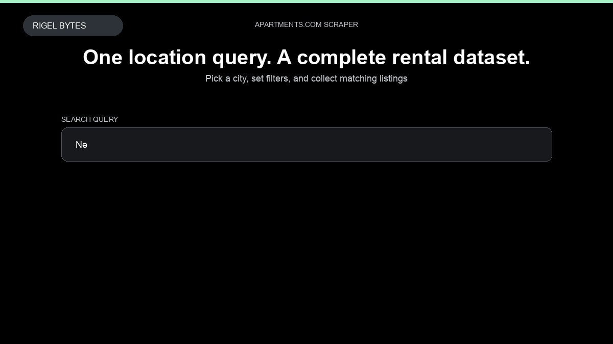

# Apartments.com Scraper

**Apartments.com Scraper** is an Apify Actor by Rigel Bytes for Apartments.com data.

This folder hosts the public demo GIF used on the Actor README. The scraper itself runs on Apify Store — not in this repository.

**[Apartments.com Scraper on Apify](https://apify.com/rigelbytes/apartments-scraper)**

## What this Apartments.com scraper does

Scrape US rental listings from Apartments.com by location query — prices, beds/baths, photos, amenities, and contact info for market research and lead generation.

Use it as a Apartments.com scraper to extract structured data and export CSV, JSON, Excel, or XML from Apify.

## Start here

1. Open [Apartments.com Scraper](https://apify.com/rigelbytes/apartments-scraper) on Apify Store.
2. Paste your Apartments.com URLs, queries, or other documented inputs.
3. Click **Start** and export JSON, CSV, Excel, or XML.

If you found this GitHub page while looking for a Apartments.com scraper, use the Apify link above to run it.
