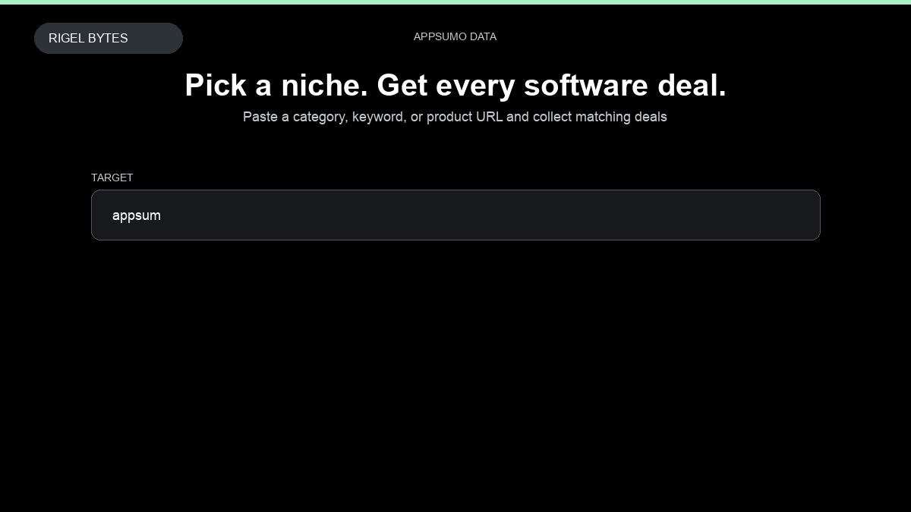

# AppSumo Scraper

**AppSumo Scraper** is an Apify Actor by Rigel Bytes for AppSumo data.

This folder hosts the public demo GIF used on the Actor README. The scraper itself runs on Apify Store — not in this repository.

**[AppSumo Scraper on Apify](https://apify.com/rigelbytes/appsumo-scraper)**

## What this AppSumo scraper does

Extract AppSumo software deals — pricing, ratings, plans, founders, and reviews — for SaaS deal research and market analysis.

Use it as a AppSumo scraper to extract structured data and export CSV, JSON, Excel, or XML from Apify.

## Start here

1. Open [AppSumo Scraper](https://apify.com/rigelbytes/appsumo-scraper) on Apify Store.
2. Paste your AppSumo URLs, queries, or other documented inputs.
3. Click **Start** and export JSON, CSV, Excel, or XML.

If you found this GitHub page while looking for a AppSumo scraper, use the Apify link above to run it.
