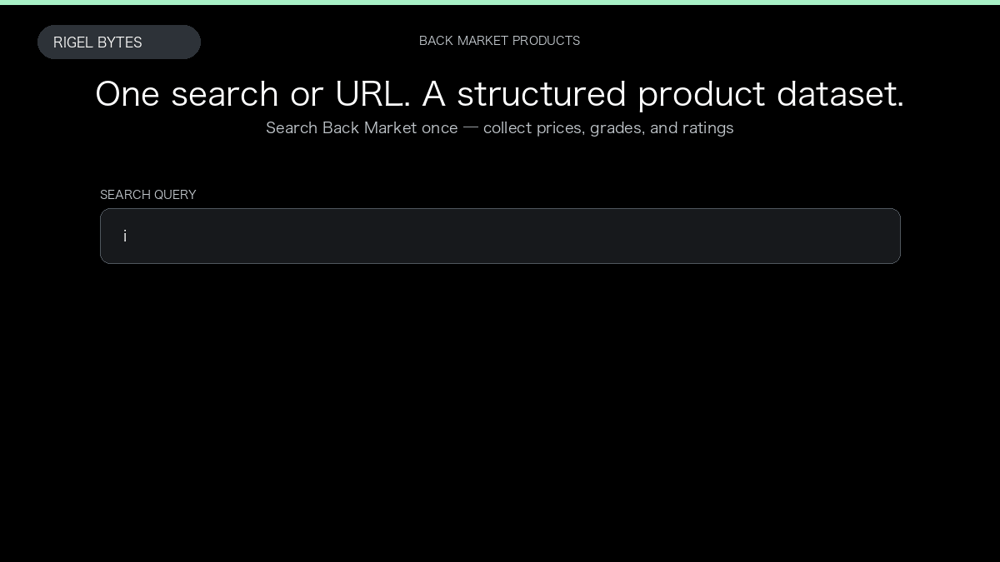

# Back Market Scraper

**Back Market Scraper** is an Apify Actor by Rigel Bytes for Back Market data.

This folder hosts the public demo GIF used on the Actor README. The scraper itself runs on Apify Store — not in this repository.

**[Back Market Scraper on Apify](https://apify.com/rigelbytes/backmarket-scraper)**

## What this Back Market scraper does

Scrape Back Market product listings from search queries or category and product URLs across 17 countries, including name, price, grade, rating, and country for price monitoring, catalog research, and review analysis.

Use it as a Back Market scraper to extract structured data and export CSV, JSON, Excel, or XML from Apify.

## Start here

1. Open [Back Market Scraper](https://apify.com/rigelbytes/backmarket-scraper) on Apify Store.
2. Paste your Back Market URLs, queries, or other documented inputs.
3. Click **Start** and export JSON, CSV, Excel, or XML.

If you found this GitHub page while looking for a Back Market scraper, use the Apify link above to run it.
