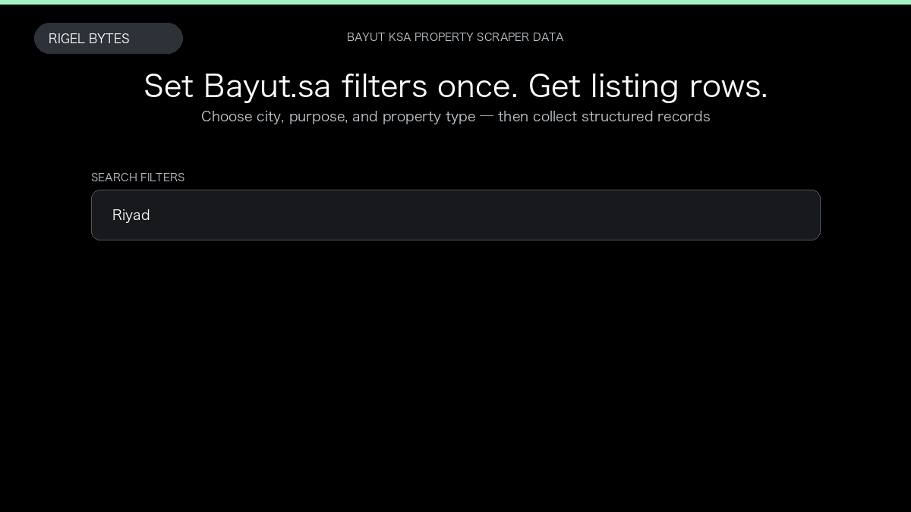

# Bayut KSA Property Scraper

**Bayut KSA Property Scraper** is an Apify Actor by Rigel Bytes for Bayut.sa data.

This folder hosts the public demo GIF used on the Actor README. The scraper itself runs on Apify Store — not in this repository.

**[Bayut KSA Property Scraper on Apify](https://apify.com/rigelbytes/bayut-sa-scraper)**

## What this Bayut.sa scraper does

Scrape Bayut.sa property listings from Saudi Arabia with filters for city, purpose, and type — export structured rows with price, location, agency, and agent for market research and lead generation.

Use it as a Bayut.sa scraper to extract structured data and export CSV, JSON, Excel, or XML from Apify.

## Start here

1. Open [Bayut KSA Property Scraper](https://apify.com/rigelbytes/bayut-sa-scraper) on Apify Store.
2. Paste your Bayut.sa URLs, queries, or other documented inputs.
3. Click **Start** and export JSON, CSV, Excel, or XML.

If you found this GitHub page while looking for a Bayut.sa scraper, use the Apify link above to run it.
