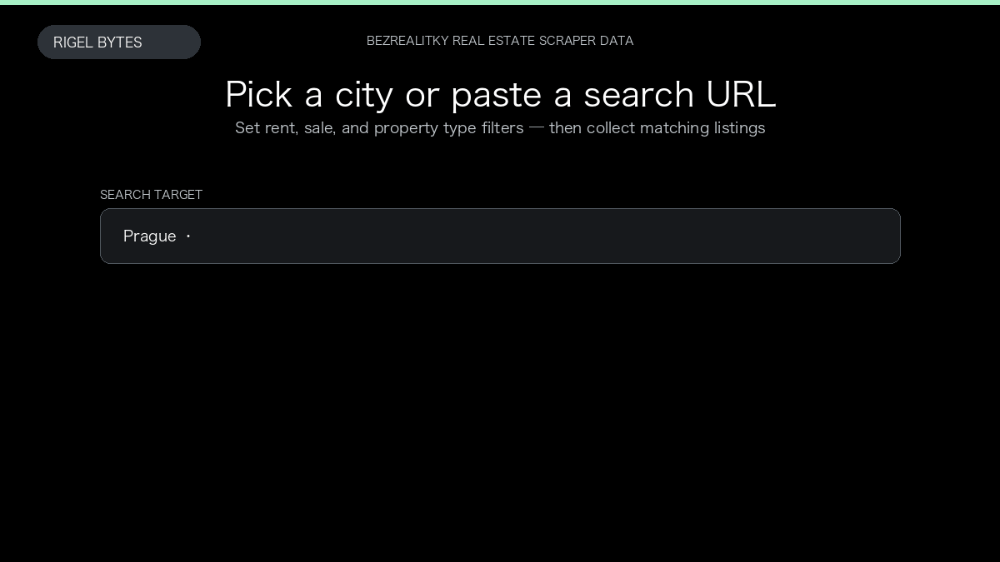

# Bezrealitky Real Estate Scraper

**Bezrealitky Real Estate Scraper** is an Apify Actor by Rigel Bytes for Bezrealitky data.

This folder hosts the public demo GIF used on the Actor README. The scraper itself runs on Apify Store — not in this repository.

**[Bezrealitky Real Estate Scraper on Apify](https://apify.com/rigelbytes/bezrealitky-scraper)**

## What this Bezrealitky scraper does

Scrape Bezrealitky.cz listings by Czech location or search URL. Export structured rental and sale data with optional full listing details.

Use it as a Bezrealitky scraper to extract structured data and export CSV, JSON, Excel, or XML from Apify.

## Start here

1. Open [Bezrealitky Real Estate Scraper](https://apify.com/rigelbytes/bezrealitky-scraper) on Apify Store.
2. Paste your Bezrealitky URLs, queries, or other documented inputs.
3. Click **Start** and export JSON, CSV, Excel, or XML.

If you found this GitHub page while looking for a Bezrealitky scraper, use the Apify link above to run it.
