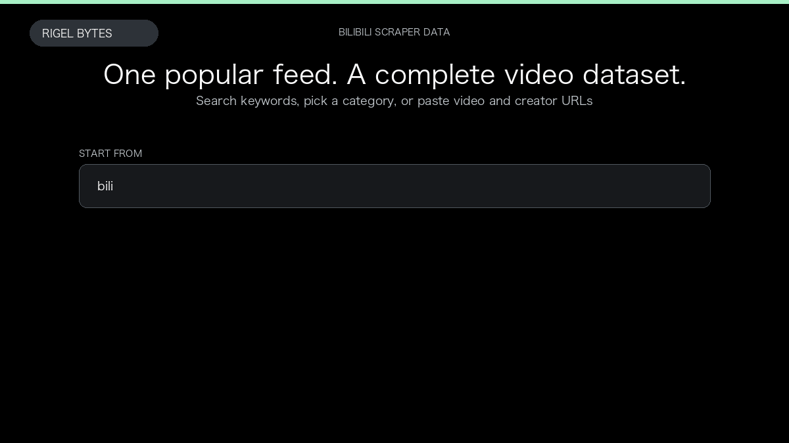

# Bilibili Scraper

**Bilibili Scraper** is an Apify Actor by Rigel Bytes for Bilibili data.

This folder hosts the public demo GIF used on the Actor README. The scraper itself runs on Apify Store — not in this repository.

**[Bilibili Scraper on Apify](https://apify.com/rigelbytes/bilibili-scraper)**

## What this Bilibili scraper does

Extract Bilibili videos, search results, categories, and creator spaces — titles, plays, likes, and optional creator profiles — for trend research and monitoring.

Use it as a Bilibili scraper to extract structured data and export CSV, JSON, Excel, or XML from Apify.

## Start here

1. Open [Bilibili Scraper](https://apify.com/rigelbytes/bilibili-scraper) on Apify Store.
2. Paste your Bilibili URLs, queries, or other documented inputs.
3. Click **Start** and export JSON, CSV, Excel, or XML.

If you found this GitHub page while looking for a Bilibili scraper, use the Apify link above to run it.
