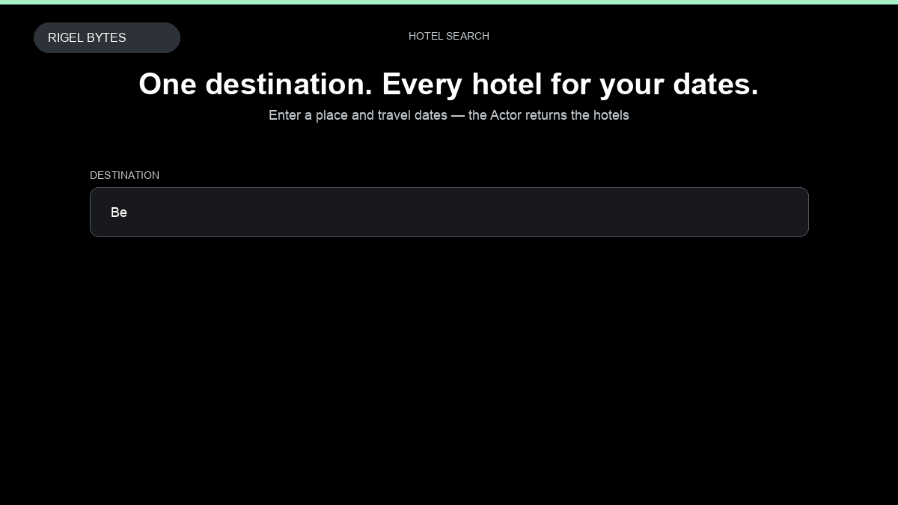

# Booking.com Scraper

**Booking.com Scraper** is an Apify Actor by Rigel Bytes for Booking.com data.

This folder hosts the public demo GIF used on the Actor README. The scraper itself runs on Apify Store — not in this repository.

**[Booking.com Scraper on Apify](https://apify.com/rigelbytes/booking-com-scraper)**

## What this Booking.com scraper does

Scrape hotel listings, prices, review scores, and availability from Booking.com to compare stays and track rates.

Use it as a Booking.com scraper to extract structured data and export CSV, JSON, Excel, or XML from Apify.

## Start here

1. Open [Booking.com Scraper](https://apify.com/rigelbytes/booking-com-scraper) on Apify Store.
2. Paste your Booking.com URLs, queries, or other documented inputs.
3. Click **Start** and export JSON, CSV, Excel, or XML.

If you found this GitHub page while looking for a Booking.com scraper, use the Apify link above to run it.
