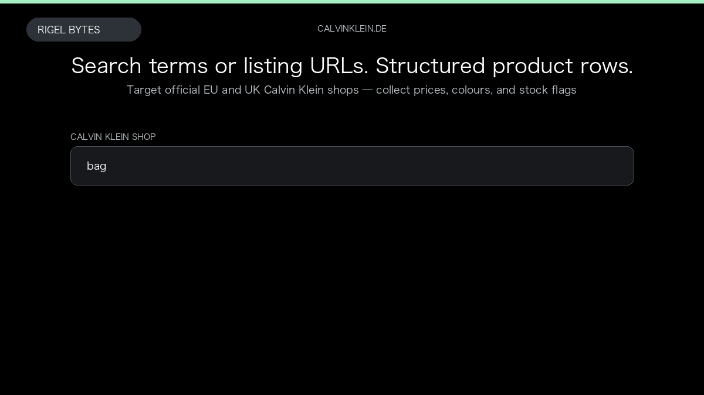

# Calvin Klein Product Scraper

**Calvin Klein Product Scraper** is an Apify Actor by Rigel Bytes for Calvin Klein (official EU/UK shops) data.

This folder hosts the public demo GIF used on the Actor README. The scraper itself runs on Apify Store — not in this repository.

**[Calvin Klein Product Scraper on Apify](https://apify.com/rigelbytes/calvinklein-scraper)**

## What this Calvin Klein (official EU/UK shops) scraper does

Scrape Calvin Klein products from official European and UK shops using search queries or category URLs, with prices, colours, stock flags, and optional full product details.

Use it as a Calvin Klein (official EU/UK shops) scraper to extract structured data and export CSV, JSON, Excel, or XML from Apify.

## Start here

1. Open [Calvin Klein Product Scraper](https://apify.com/rigelbytes/calvinklein-scraper) on Apify Store.
2. Paste your Calvin Klein (official EU/UK shops) URLs, queries, or other documented inputs.
3. Click **Start** and export JSON, CSV, Excel, or XML.

If you found this GitHub page while looking for a Calvin Klein (official EU/UK shops) scraper, use the Apify link above to run it.
