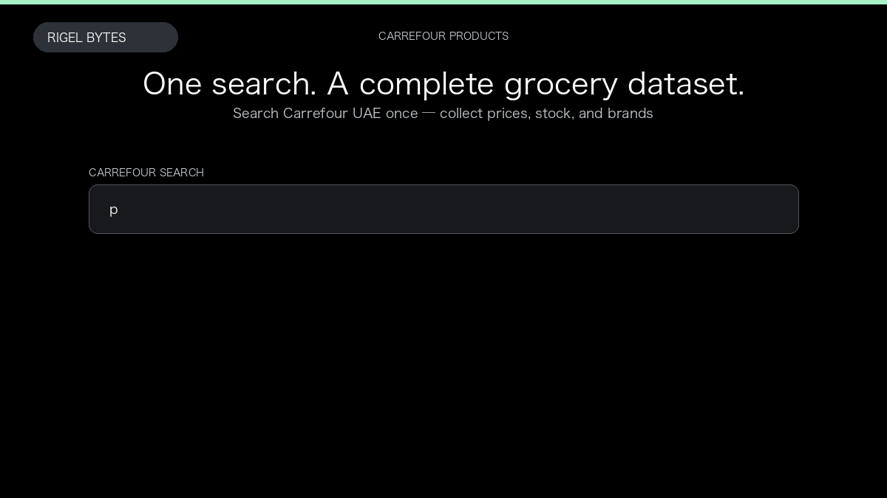

# Carrefour Product Scraper

**Carrefour Product Scraper** is an Apify Actor by Rigel Bytes for Carrefour data.

This folder hosts the public demo GIF used on the Actor README. The scraper itself runs on Apify Store — not in this repository.

**[Carrefour Product Scraper on Apify](https://apify.com/rigelbytes/carrefour-scraper)**

## What this Carrefour scraper does

Extract Carrefour grocery products, prices, stock, and optional EAN details from UAE, Saudi Arabia, Qatar, Pakistan, and Georgia for price monitoring and catalog research.

Use it as a Carrefour scraper to extract structured data and export CSV, JSON, Excel, or XML from Apify.

## Start here

1. Open [Carrefour Product Scraper](https://apify.com/rigelbytes/carrefour-scraper) on Apify Store.
2. Paste your Carrefour URLs, queries, or other documented inputs.
3. Click **Start** and export JSON, CSV, Excel, or XML.

If you found this GitHub page while looking for a Carrefour scraper, use the Apify link above to run it.
