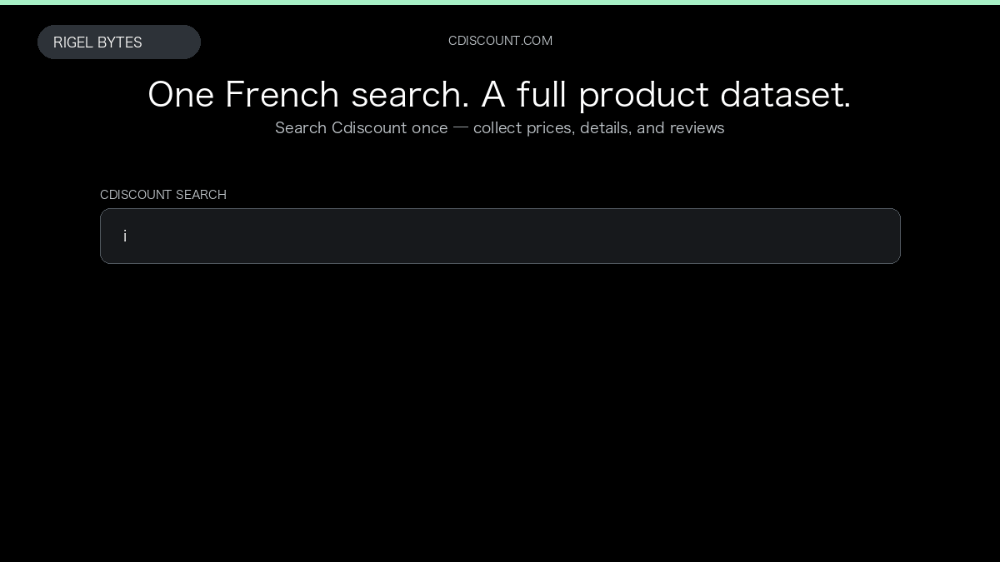

# Cdiscount Scraper

**Cdiscount Scraper** is an Apify Actor by Rigel Bytes for Cdiscount data.

This folder hosts the public demo GIF used on the Actor README. The scraper itself runs on Apify Store — not in this repository.

**[Cdiscount Scraper on Apify](https://apify.com/rigelbytes/cdiscount-scraper)**

## What this Cdiscount scraper does

Extract Cdiscount France product listings, prices, optional details, and customer reviews for price monitoring, catalogs, and review analysis.

Use it as a Cdiscount scraper to extract structured data and export CSV, JSON, Excel, or XML from Apify.

## Start here

1. Open [Cdiscount Scraper](https://apify.com/rigelbytes/cdiscount-scraper) on Apify Store.
2. Paste your Cdiscount URLs, queries, or other documented inputs.
3. Click **Start** and export JSON, CSV, Excel, or XML.

If you found this GitHub page while looking for a Cdiscount scraper, use the Apify link above to run it.
