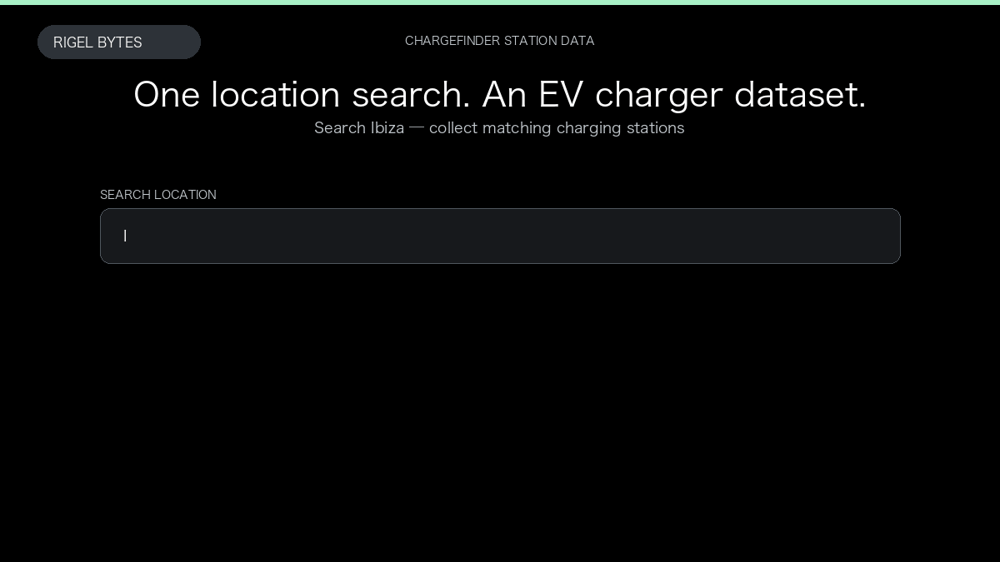

# Chargefinder Scraper

**Chargefinder Scraper** is an Apify Actor by Rigel Bytes for Chargefinder data.

This folder hosts the public demo GIF used on the Actor README. The scraper itself runs on Apify Store — not in this repository.

**[Chargefinder Scraper on Apify](https://apify.com/rigelbytes/chargefinder-scraper)**

## What this Chargefinder scraper does

Extract EV charging stations from Chargefinder by location or charger URL for network mapping, availability monitoring, and operator research.

Use it as a Chargefinder scraper to extract structured data and export CSV, JSON, Excel, or XML from Apify.

## Start here

1. Open [Chargefinder Scraper](https://apify.com/rigelbytes/chargefinder-scraper) on Apify Store.
2. Paste your Chargefinder URLs, queries, or other documented inputs.
3. Click **Start** and export JSON, CSV, Excel, or XML.

If you found this GitHub page while looking for a Chargefinder scraper, use the Apify link above to run it.
