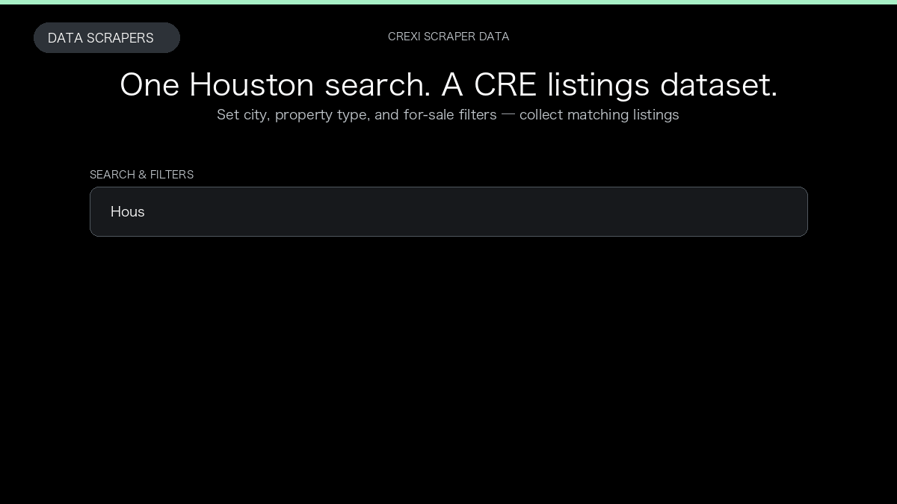

# Crexi Scraper

**Crexi Scraper** is an Apify Actor by Data Scrapers for Crexi data.

This folder hosts the public demo GIF used on the Actor README. The scraper itself runs on Apify Store — not in this repository.

**[Crexi Scraper on Apify](https://apify.com/datascrapers/crexi-scraper)**

## What this Crexi scraper does

Crexi commercial real estate listings for sale and lease, with prices, property types, locations, and optional broker details.

Use it as a Crexi scraper to extract structured data and export CSV, JSON, Excel, or XML from Apify.

## Start here

1. Open [Crexi Scraper](https://apify.com/datascrapers/crexi-scraper) on Apify Store.
2. Paste your Crexi URLs, queries, or other documented inputs.
3. Click **Start** and export JSON, CSV, Excel, or XML.

If you found this GitHub page while looking for a Crexi scraper, use the Apify link above to run it.
