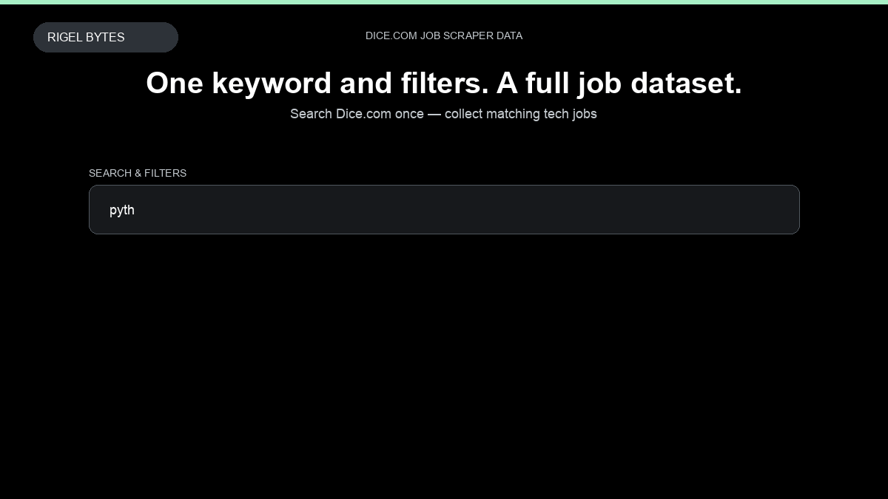

# Dice.com Job Scraper

**Dice.com Job Scraper** is an Apify Actor by Rigel Bytes for Dice.com data.

This folder hosts the public demo GIF used on the Actor README. The scraper itself runs on Apify Store — not in this repository.

**[Dice.com Job Scraper on Apify](https://apify.com/rigelbytes/dice-scraper)**

## What this Dice.com scraper does

Scrape Dice.com tech jobs by keyword, URL, and filters. Export structured job listings with titles, companies, salaries, and workplace types for recruiting and market monitoring.

Use it as a Dice.com scraper to extract structured data and export CSV, JSON, Excel, or XML from Apify.

## Start here

1. Open [Dice.com Job Scraper](https://apify.com/rigelbytes/dice-scraper) on Apify Store.
2. Paste your Dice.com URLs, queries, or other documented inputs.
3. Click **Start** and export JSON, CSV, Excel, or XML.

If you found this GitHub page while looking for a Dice.com scraper, use the Apify link above to run it.
