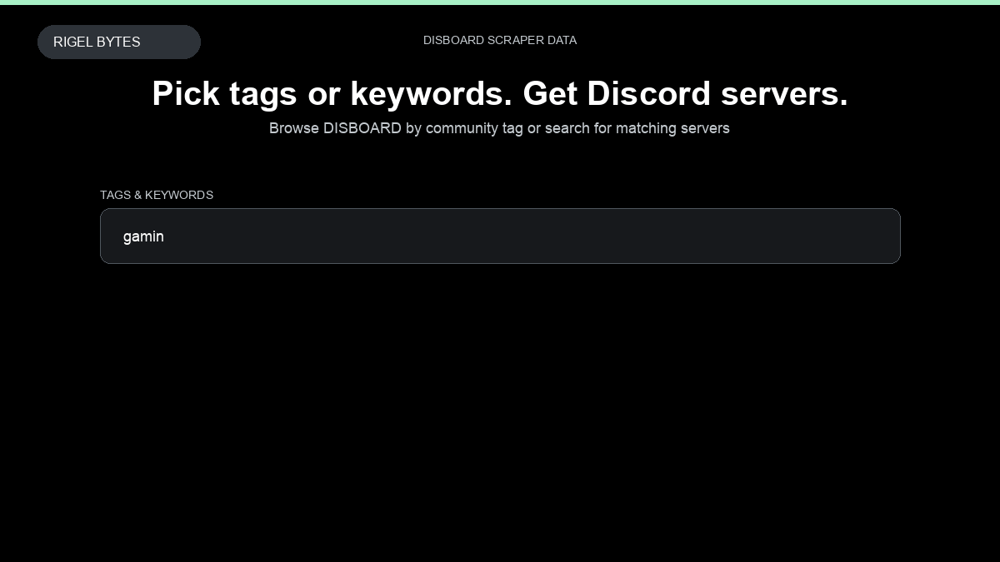

# Disboard Scraper

**Disboard Scraper** is an Apify Actor by Rigel Bytes for DISBOARD data.

This folder hosts the public demo GIF used on the Actor README. The scraper itself runs on Apify Store — not in this repository.

**[Disboard Scraper on Apify](https://apify.com/rigelbytes/disboard-scraper)**

## What this DISBOARD scraper does

Scrape Discord server listings from DISBOARD by community tag or search query. Extract server name, members, ratings, tags, and descriptions for community research and lead generation.

Use it as a DISBOARD scraper to extract structured data and export CSV, JSON, Excel, or XML from Apify.

## Start here

1. Open [Disboard Scraper](https://apify.com/rigelbytes/disboard-scraper) on Apify Store.
2. Paste your DISBOARD URLs, queries, or other documented inputs.
3. Click **Start** and export JSON, CSV, Excel, or XML.

If you found this GitHub page while looking for a DISBOARD scraper, use the Apify link above to run it.
