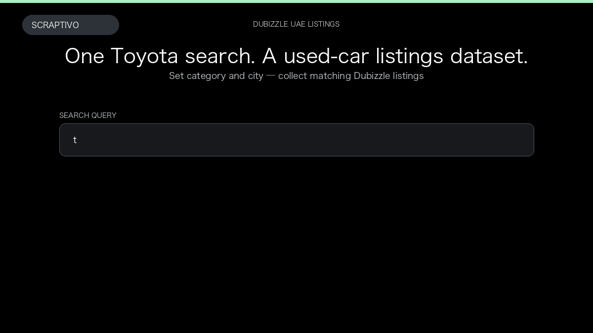

# Dubizzle UAE Scraper

**Dubizzle UAE Scraper** is an Apify Actor by Rigel Bytes for Dubizzle UAE data.

This folder hosts the public demo GIF used on the Actor README. The scraper itself runs on Apify Store — not in this repository.

**[Dubizzle UAE Scraper on Apify](https://apify.com/rigelbytes/dubizzle-scraper)**

## What this Dubizzle UAE scraper does

Extract Dubizzle UAE listings as structured data — titles, AED prices, cities, photos, and dealer contact details. Compare and export used cars, property, jobs, and classifieds as JSON, CSV, or Excel.

Use it as a Dubizzle UAE scraper to extract structured data and export CSV, JSON, Excel, or XML from Apify.

## Start here

1. Open [Dubizzle UAE Scraper](https://apify.com/rigelbytes/dubizzle-scraper) on Apify Store.
2. Paste your Dubizzle UAE URLs, queries, or other documented inputs.
3. Click **Start** and export JSON, CSV, Excel, or XML.

If you found this GitHub page while looking for a Dubizzle UAE scraper, use the Apify link above to run it.
