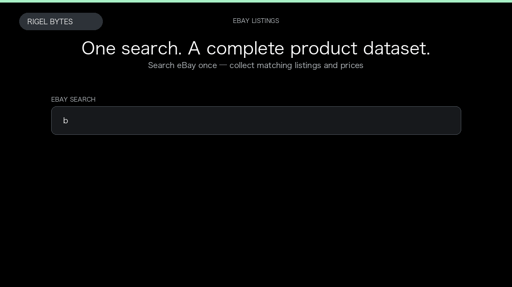

# eBay Product Scraper

**eBay Product Scraper** is an Apify Actor by Rigel Bytes for eBay data.

This folder hosts the public demo GIF used on the Actor README. The scraper itself runs on Apify Store — not in this repository.

**[eBay Product Scraper on Apify](https://apify.com/rigelbytes/ebay-scraper)**

## What this eBay scraper does

Extract eBay product listings and optional item-page details for price monitoring, catalogs, and competitor research.

Use it as a eBay scraper to extract structured data and export CSV, JSON, Excel, or XML from Apify.

## Start here

1. Open [eBay Product Scraper](https://apify.com/rigelbytes/ebay-scraper) on Apify Store.
2. Paste your eBay URLs, queries, or other documented inputs.
3. Click **Start** and export JSON, CSV, Excel, or XML.

If you found this GitHub page while looking for a eBay scraper, use the Apify link above to run it.
