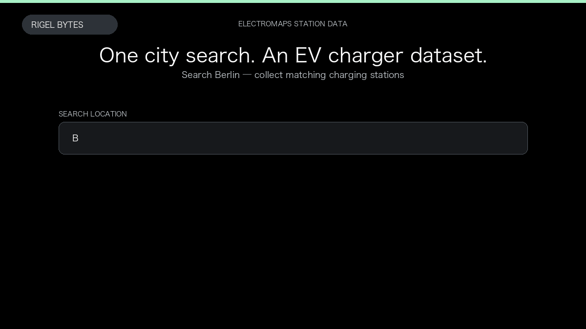

# Electromaps Scraper

**Electromaps Scraper** is an Apify Actor by Rigel Bytes for Electromaps data.

This folder hosts the public demo GIF used on the Actor README. The scraper itself runs on Apify Store — not in this repository.

**[Electromaps Scraper on Apify](https://apify.com/rigelbytes/electromaps-scraper)**

## What this Electromaps scraper does

Extract EV charging stations from Electromaps by city or country, including connectors, status, and location data for coverage maps and research.

Use it as a Electromaps scraper to extract structured data and export CSV, JSON, Excel, or XML from Apify.

## Start here

1. Open [Electromaps Scraper](https://apify.com/rigelbytes/electromaps-scraper) on Apify Store.
2. Paste your Electromaps URLs, queries, or other documented inputs.
3. Click **Start** and export JSON, CSV, Excel, or XML.

If you found this GitHub page while looking for a Electromaps scraper, use the Apify link above to run it.
