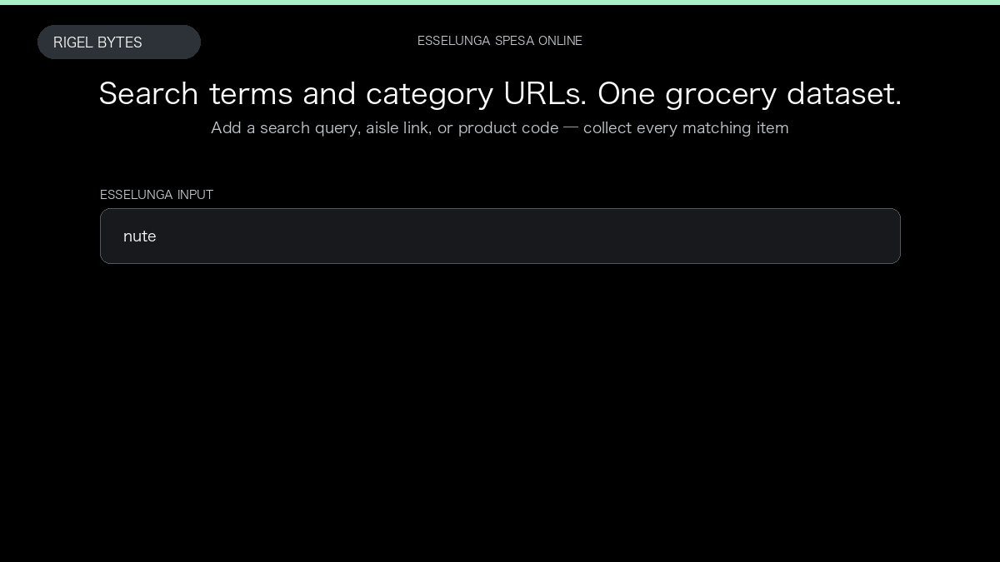

# Esselunga Scraper

**Esselunga Scraper** is an Apify Actor by Rigel Bytes for Esselunga Spesa Online data.

This folder hosts the public demo GIF used on the Actor README. The scraper itself runs on Apify Store — not in this repository.

**[Esselunga Scraper on Apify](https://apify.com/rigelbytes/esselunga-scraper)**

## What this Esselunga Spesa Online scraper does

Extract Esselunga grocery products from search queries, category pages, and product links, with optional ingredients, nutrition, and usage details for price monitoring and assortment research.

Use it as a Esselunga Spesa Online scraper to extract structured data and export CSV, JSON, Excel, or XML from Apify.

## Start here

1. Open [Esselunga Scraper](https://apify.com/rigelbytes/esselunga-scraper) on Apify Store.
2. Paste your Esselunga Spesa Online URLs, queries, or other documented inputs.
3. Click **Start** and export JSON, CSV, Excel, or XML.

If you found this GitHub page while looking for a Esselunga Spesa Online scraper, use the Apify link above to run it.
