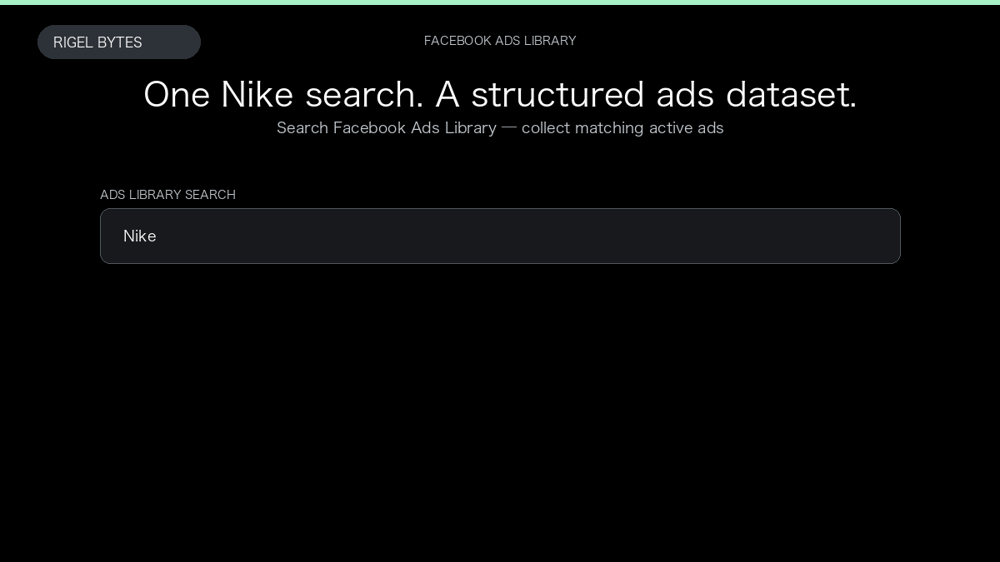

# Facebook Ads Library Scraper

**Facebook Ads Library Scraper** is an Apify Actor by Rigel Bytes for Facebook Ads Library data.

This folder hosts the public demo GIF used on the Actor README. The scraper itself runs on Apify Store — not in this repository.

**[Facebook Ads Library Scraper on Apify](https://apify.com/rigelbytes/facebook-ads-scraper)**

## What this Facebook Ads Library scraper does

Extract Facebook Ads Library creatives, advertisers, platforms, and dates for competitive research and ad monitoring.

Use it as a Facebook Ads Library scraper to extract structured data and export CSV, JSON, Excel, or XML from Apify.

## Start here

1. Open [Facebook Ads Library Scraper](https://apify.com/rigelbytes/facebook-ads-scraper) on Apify Store.
2. Paste your Facebook Ads Library URLs, queries, or other documented inputs.
3. Click **Start** and export JSON, CSV, Excel, or XML.

If you found this GitHub page while looking for a Facebook Ads Library scraper, use the Apify link above to run it.
