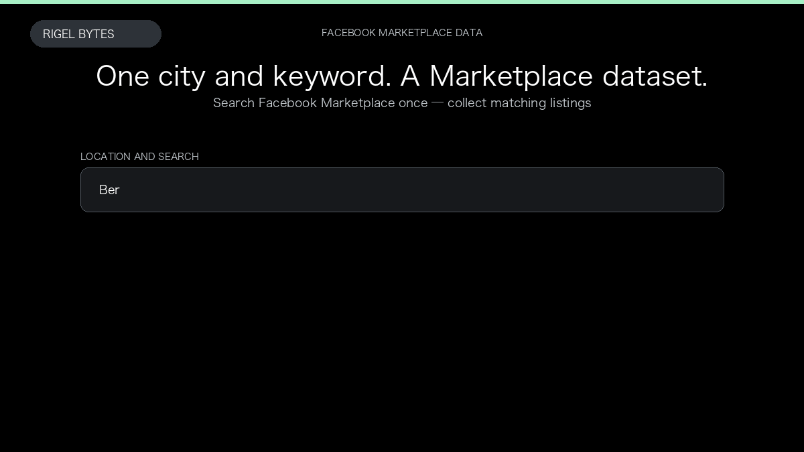

# Facebook Marketplace Scraper

**Facebook Marketplace Scraper** is an Apify Actor by Rigel Bytes for Facebook Marketplace data.

This folder hosts the public demo GIF used on the Actor README. The scraper itself runs on Apify Store — not in this repository.

**[Facebook Marketplace Scraper on Apify](https://apify.com/rigelbytes/facebook-marketplace)**

## What this Facebook Marketplace scraper does

Extract Facebook Marketplace listings by location, category, keyword, and price filters. Export titles, prices, photos, and locations for research and monitoring.

Use it as a Facebook Marketplace scraper to extract structured data and export CSV, JSON, Excel, or XML from Apify.

## Start here

1. Open [Facebook Marketplace Scraper](https://apify.com/rigelbytes/facebook-marketplace) on Apify Store.
2. Paste your Facebook Marketplace URLs, queries, or other documented inputs.
3. Click **Start** and export JSON, CSV, Excel, or XML.

If you found this GitHub page while looking for a Facebook Marketplace scraper, use the Apify link above to run it.
