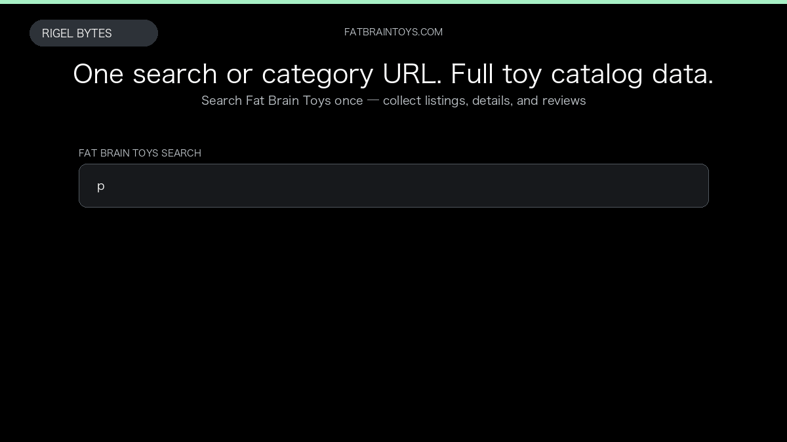

# Fat Brain Toys Scraper

**Fat Brain Toys Scraper** is an Apify Actor by Rigel Bytes for Fat Brain Toys data.

This folder hosts the public demo GIF used on the Actor README. The scraper itself runs on Apify Store — not in this repository.

**[Fat Brain Toys Scraper on Apify](https://apify.com/rigelbytes/fatbraintoys-scraper)**

## What this Fat Brain Toys scraper does

Extract Fat Brain Toys search and category listings with optional product details and customer reviews for price tracking and catalog building.

Use it as a Fat Brain Toys scraper to extract structured data and export CSV, JSON, Excel, or XML from Apify.

## Start here

1. Open [Fat Brain Toys Scraper](https://apify.com/rigelbytes/fatbraintoys-scraper) on Apify Store.
2. Paste your Fat Brain Toys URLs, queries, or other documented inputs.
3. Click **Start** and export JSON, CSV, Excel, or XML.

If you found this GitHub page while looking for a Fat Brain Toys scraper, use the Apify link above to run it.
