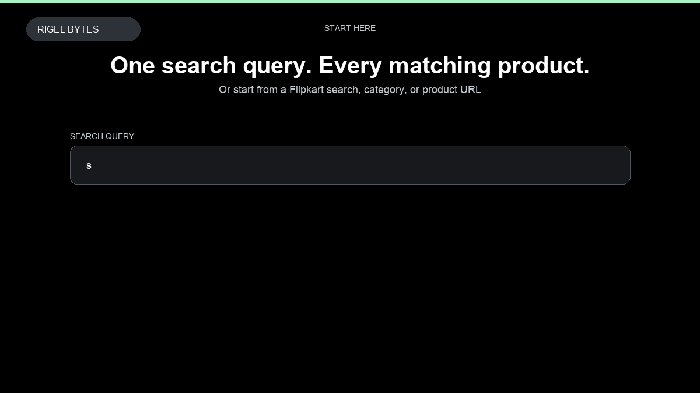

# Flipkart Product Scraper

**Flipkart Product Scraper** is an Apify Actor by Rigel Bytes for Flipkart data.

This folder hosts the public demo GIF used on the Actor README. The scraper itself runs on Apify Store — not in this repository.

**[Flipkart Product Scraper on Apify](https://apify.com/rigelbytes/flipkart-scraper)**

## What this Flipkart scraper does

Scrape Flipkart product listings, prices, ratings, and reviews into structured data for price monitoring and market research.

Use it as a Flipkart scraper to extract structured data and export CSV, JSON, Excel, or XML from Apify.

## Start here

1. Open [Flipkart Product Scraper](https://apify.com/rigelbytes/flipkart-scraper) on Apify Store.
2. Paste your Flipkart URLs, queries, or other documented inputs.
3. Click **Start** and export JSON, CSV, Excel, or XML.

If you found this GitHub page while looking for a Flipkart scraper, use the Apify link above to run it.
