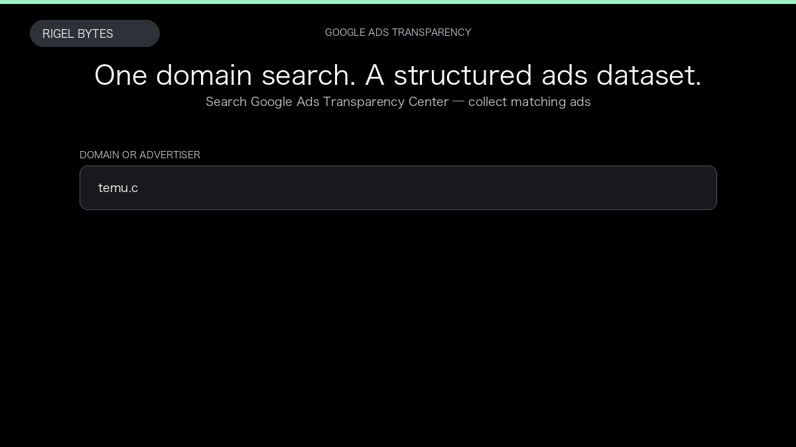

# Google Ads Transparency Scraper

**Google Ads Transparency Scraper** is an Apify Actor by Rigel Bytes for Google Ads Transparency Center data.

This folder hosts the public demo GIF used on the Actor README. The scraper itself runs on Apify Store — not in this repository.

**[Google Ads Transparency Scraper on Apify](https://apify.com/rigelbytes/google-ads-scraper)**

## What this Google Ads Transparency Center scraper does

Extract ads from the Google Ads Transparency Center by domain, advertiser, or keyword — creatives, dates, and regions for competitor research.

Use it as a Google Ads Transparency Center scraper to extract structured data and export CSV, JSON, Excel, or XML from Apify.

## Start here

1. Open [Google Ads Transparency Scraper](https://apify.com/rigelbytes/google-ads-scraper) on Apify Store.
2. Paste your Google Ads Transparency Center URLs, queries, or other documented inputs.
3. Click **Start** and export JSON, CSV, Excel, or XML.

If you found this GitHub page while looking for a Google Ads Transparency Center scraper, use the Apify link above to run it.
