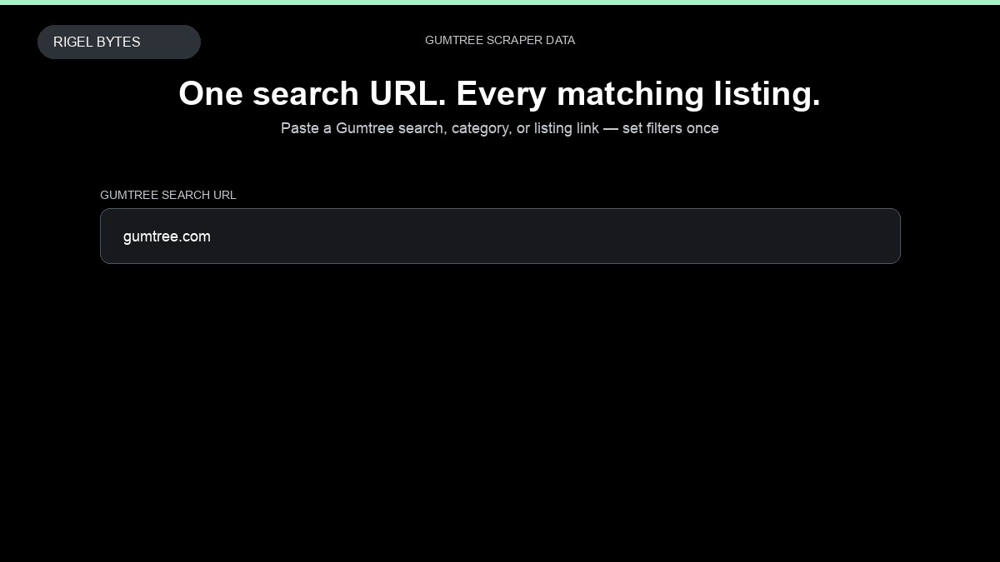

# Gumtree Scraper

**Gumtree Scraper** is an Apify Actor by Rigel Bytes for Gumtree data.

This folder hosts the public demo GIF used on the Actor README. The scraper itself runs on Apify Store — not in this repository.

**[Gumtree Scraper on Apify](https://apify.com/rigelbytes/gumtree-scraper)**

## What this Gumtree scraper does

Scrape Gumtree UK listings from search URLs, category filters, or direct listing links. Extract titles, prices, locations, descriptions, images, seller info, and phone numbers when available.

Use it as a Gumtree scraper to extract structured data and export CSV, JSON, Excel, or XML from Apify.

## Start here

1. Open [Gumtree Scraper](https://apify.com/rigelbytes/gumtree-scraper) on Apify Store.
2. Paste your Gumtree URLs, queries, or other documented inputs.
3. Click **Start** and export JSON, CSV, Excel, or XML.

If you found this GitHub page while looking for a Gumtree scraper, use the Apify link above to run it.
