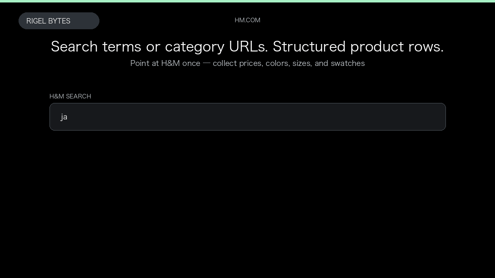

# H&M Scraper

**H&M Scraper** is an Apify Actor by Rigel Bytes for H&M data.

This folder hosts the public demo GIF used on the Actor README. The scraper itself runs on Apify Store — not in this repository.

**[H&M Scraper on Apify](https://apify.com/rigelbytes/h-and-m-scraper)**

## What this H&M scraper does

Scrape H&M products from search and category URLs with optional descriptions and composition.

Use it as a H&M scraper to extract structured data and export CSV, JSON, Excel, or XML from Apify.

## Start here

1. Open [H&M Scraper](https://apify.com/rigelbytes/h-and-m-scraper) on Apify Store.
2. Paste your H&M URLs, queries, or other documented inputs.
3. Click **Start** and export JSON, CSV, Excel, or XML.

If you found this GitHub page while looking for a H&M scraper, use the Apify link above to run it.
