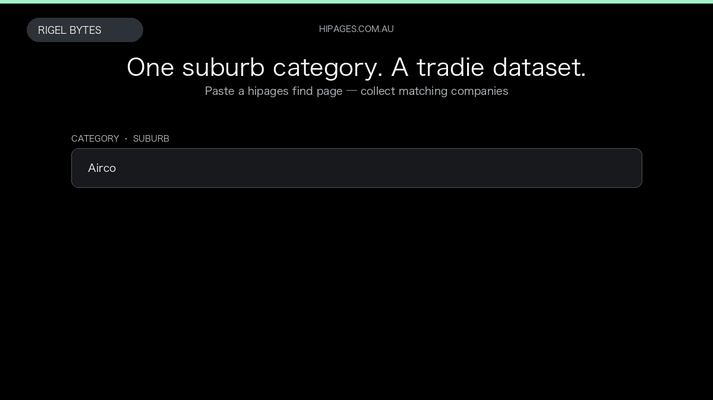

# hipages Australia Scraper

**hipages Australia Scraper** is an Apify Actor by Rigel Bytes for hipages.com.au data.

This folder hosts the public demo GIF used on the Actor README. The scraper itself runs on Apify Store — not in this repository.

**[hipages Australia Scraper on Apify](https://apify.com/rigelbytes/hipages-au-scraper)**

## What this hipages.com.au scraper does

Extract Australian tradie listings from hipages.com.au — company names, ratings, contacts, ABNs, and reviews — for lead generation and competitor research.

Use it as a hipages.com.au scraper to extract structured data and export CSV, JSON, Excel, or XML from Apify.

## Start here

1. Open [hipages Australia Scraper](https://apify.com/rigelbytes/hipages-au-scraper) on Apify Store.
2. Paste your hipages.com.au URLs, queries, or other documented inputs.
3. Click **Start** and export JSON, CSV, Excel, or XML.

If you found this GitHub page while looking for a hipages.com.au scraper, use the Apify link above to run it.
