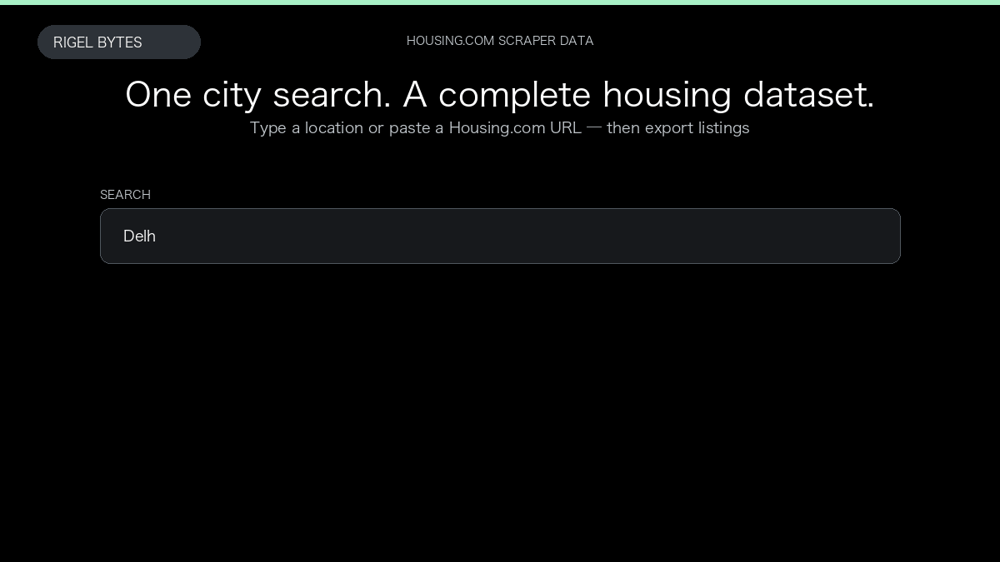

# Housing.com Scraper

**Housing.com Scraper** is an Apify Actor by Rigel Bytes for Housing.com data.

This folder hosts the public demo GIF used on the Actor README. The scraper itself runs on Apify Store — not in this repository.

**[Housing.com Scraper on Apify](https://apify.com/rigelbytes/housing-com-scraper)**

## What this Housing.com scraper does

Extract Housing.com listings — prices, BHK, locality, sellers — and optional agents for Indian market research and inventory monitoring.

Use it as a Housing.com scraper to extract structured data and export CSV, JSON, Excel, or XML from Apify.

## Start here

1. Open [Housing.com Scraper](https://apify.com/rigelbytes/housing-com-scraper) on Apify Store.
2. Paste your Housing.com URLs, queries, or other documented inputs.
3. Click **Start** and export JSON, CSV, Excel, or XML.

If you found this GitHub page while looking for a Housing.com scraper, use the Apify link above to run it.
