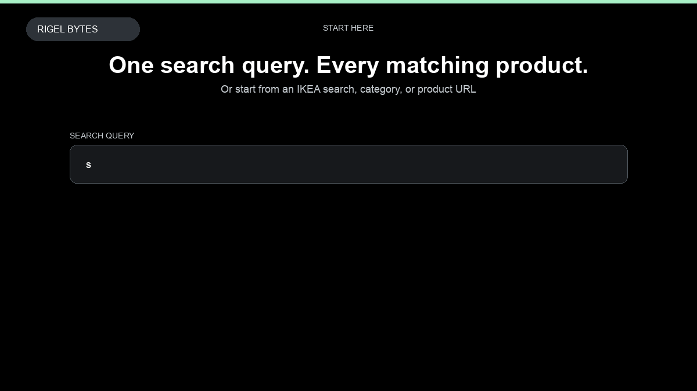

# IKEA Product Scraper

**IKEA Product Scraper** is an Apify Actor by Rigel Bytes for IKEA data.

This folder hosts the public demo GIF used on the Actor README. The scraper itself runs on Apify Store — not in this repository.

**[IKEA Product Scraper on Apify](https://apify.com/rigelbytes/ikea-scraper)**

## What this IKEA scraper does

Extract IKEA product listings from search queries or URLs — name, price, rating, measurements, materials, and optional customer reviews — for price monitoring, competitor research, and market analysis.

Use it as a IKEA scraper to extract structured data and export CSV, JSON, Excel, or XML from Apify.

## Start here

1. Open [IKEA Product Scraper](https://apify.com/rigelbytes/ikea-scraper) on Apify Store.
2. Paste your IKEA URLs, queries, or other documented inputs.
3. Click **Start** and export JSON, CSV, Excel, or XML.

If you found this GitHub page while looking for a IKEA scraper, use the Apify link above to run it.
