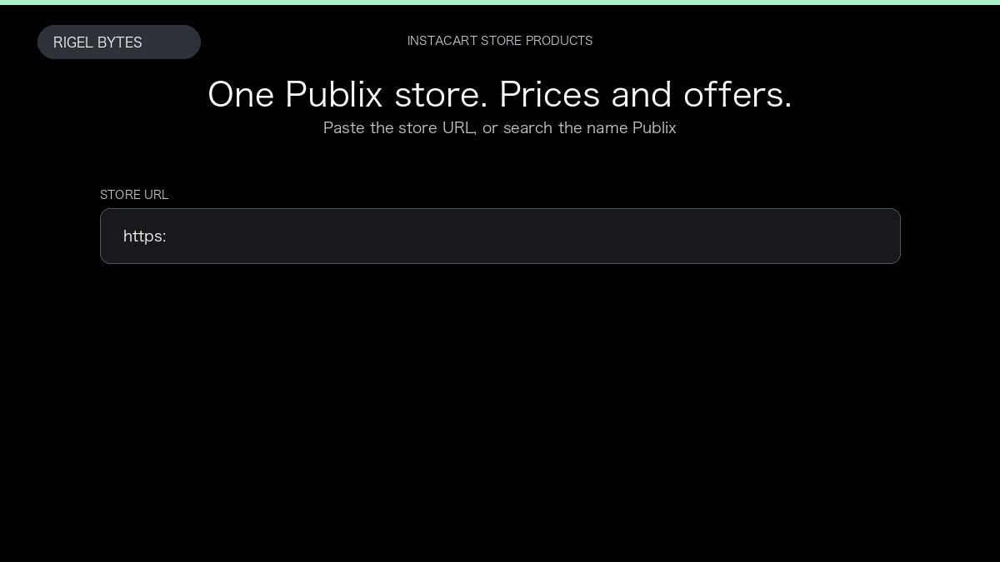

# Instacart Store Scraper

**Instacart Store Scraper** is an Apify Actor by Rigel Bytes for Instacart data.

This folder hosts the public demo GIF used on the Actor README. The scraper itself runs on Apify Store — not in this repository.

**[Instacart Store Scraper on Apify](https://apify.com/rigelbytes/instacart-store-scraper)**

## What this Instacart scraper does

Extract Instacart store aisle products, prices, and offers by store URL or store name and postal code.

Use it as a Instacart scraper to extract structured data and export CSV, JSON, Excel, or XML from Apify.

## Start here

1. Open [Instacart Store Scraper](https://apify.com/rigelbytes/instacart-store-scraper) on Apify Store.
2. Paste your Instacart URLs, queries, or other documented inputs.
3. Click **Start** and export JSON, CSV, Excel, or XML.

If you found this GitHub page while looking for a Instacart scraper, use the Apify link above to run it.
