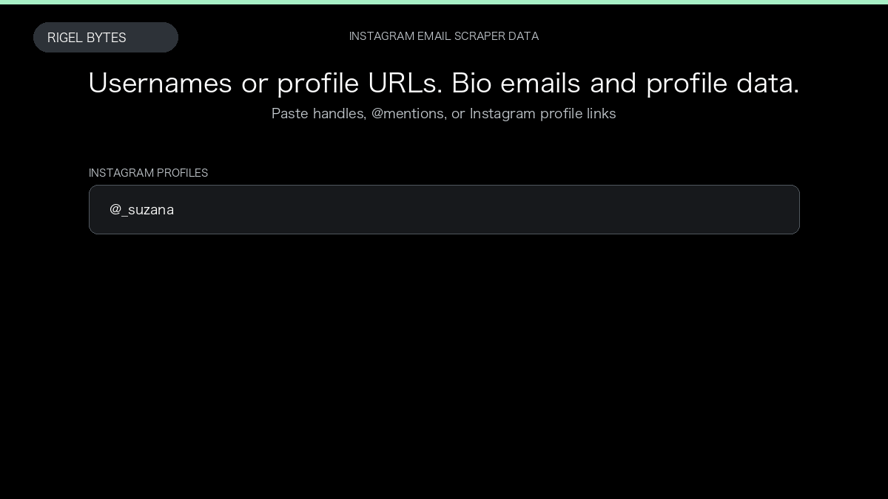

# Instagram Email Scraper

**Instagram Email Scraper** is an Apify Actor by Rigel Bytes for Instagram data.

This folder hosts the public demo GIF used on the Actor README. The scraper itself runs on Apify Store — not in this repository.

**[Instagram Email Scraper on Apify](https://apify.com/rigelbytes/instagram-email-scraper)**

## What this Instagram scraper does

Extract publicly listed emails from Instagram profile bios, plus profile details and recent posts. Export CSV or JSON for influencer outreach, lead lists, and creator research.

Use it as a Instagram scraper to extract structured data and export CSV, JSON, Excel, or XML from Apify.

## Start here

1. Open [Instagram Email Scraper](https://apify.com/rigelbytes/instagram-email-scraper) on Apify Store.
2. Paste your Instagram URLs, queries, or other documented inputs.
3. Click **Start** and export JSON, CSV, Excel, or XML.

If you found this GitHub page while looking for a Instagram scraper, use the Apify link above to run it.
