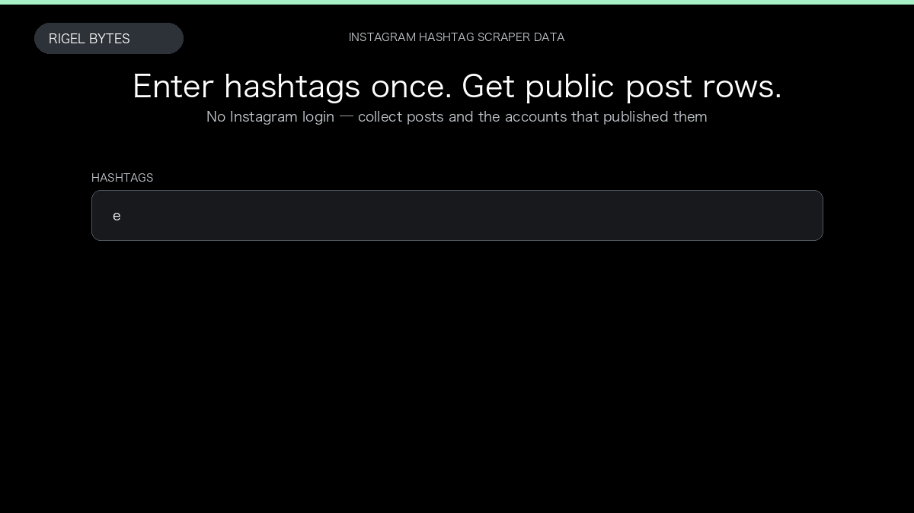

# Instagram Hashtag Scraper

**Instagram Hashtag Scraper** is an Apify Actor by Rigel Bytes for Instagram data.

This folder hosts the public demo GIF used on the Actor README. The scraper itself runs on Apify Store — not in this repository.

**[Instagram Hashtag Scraper on Apify](https://apify.com/rigelbytes/instagram-hashtag-scraper)**

## What this Instagram scraper does

Scrape public Instagram posts for any hashtag without login. Each row includes the post, engagement metrics, and the account that published it.

Use it as a Instagram scraper to extract structured data and export CSV, JSON, Excel, or XML from Apify.

## Start here

1. Open [Instagram Hashtag Scraper](https://apify.com/rigelbytes/instagram-hashtag-scraper) on Apify Store.
2. Paste your Instagram URLs, queries, or other documented inputs.
3. Click **Start** and export JSON, CSV, Excel, or XML.

If you found this GitHub page while looking for a Instagram scraper, use the Apify link above to run it.
