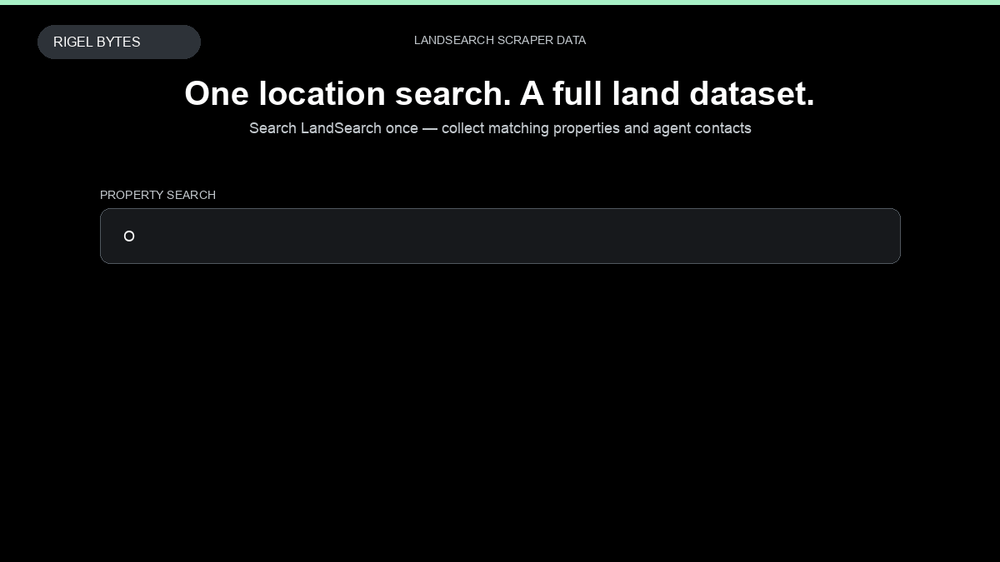

# LandSearch Scraper

**LandSearch Scraper** is an Apify Actor by Rigel Bytes for LandSearch data.

This folder hosts the public demo GIF used on the Actor README. The scraper itself runs on Apify Store — not in this repository.

**[LandSearch Scraper on Apify](https://apify.com/rigelbytes/landsearch-scraper)**

## What this LandSearch scraper does

Scrape LandSearch land listings and agent profiles by location. Get structured price, acres, address, and agent phone data for deal sourcing, lead lists, and market monitoring.

Use it as a LandSearch scraper to extract structured data and export CSV, JSON, Excel, or XML from Apify.

## Start here

1. Open [LandSearch Scraper](https://apify.com/rigelbytes/landsearch-scraper) on Apify Store.
2. Paste your LandSearch URLs, queries, or other documented inputs.
3. Click **Start** and export JSON, CSV, Excel, or XML.

If you found this GitHub page while looking for a LandSearch scraper, use the Apify link above to run it.
