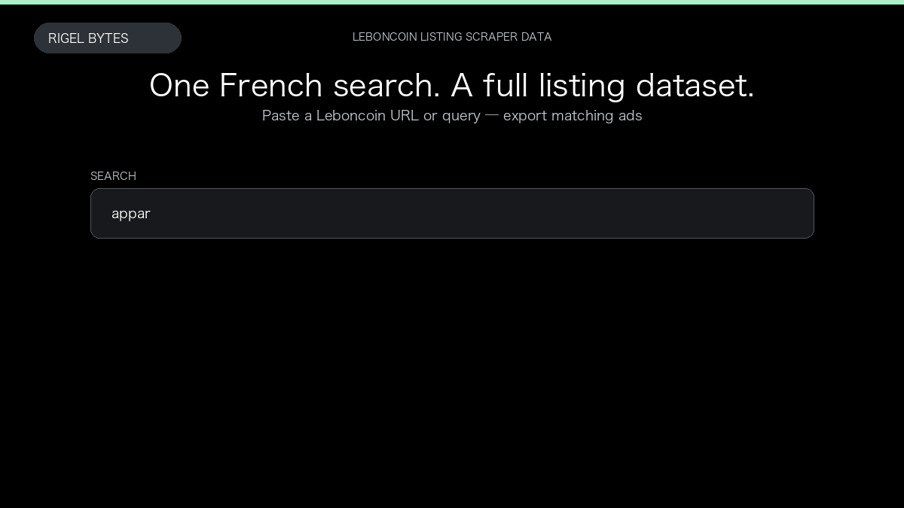

# Leboncoin Listing Scraper

**Leboncoin Listing Scraper** is an Apify Actor by Rigel Bytes for Leboncoin data.

This folder hosts the public demo GIF used on the Actor README. The scraper itself runs on Apify Store — not in this repository.

**[Leboncoin Listing Scraper on Apify](https://apify.com/rigelbytes/leboncoin-listing-scraper)**

## What this Leboncoin scraper does

Extract Leboncoin listings from a search URL or keyword — titles, prices, locations, sellers, images, and phone availability for French market research.

Use it as a Leboncoin scraper to extract structured data and export CSV, JSON, Excel, or XML from Apify.

## Start here

1. Open [Leboncoin Listing Scraper](https://apify.com/rigelbytes/leboncoin-listing-scraper) on Apify Store.
2. Paste your Leboncoin URLs, queries, or other documented inputs.
3. Click **Start** and export JSON, CSV, Excel, or XML.

If you found this GitHub page while looking for a Leboncoin scraper, use the Apify link above to run it.
