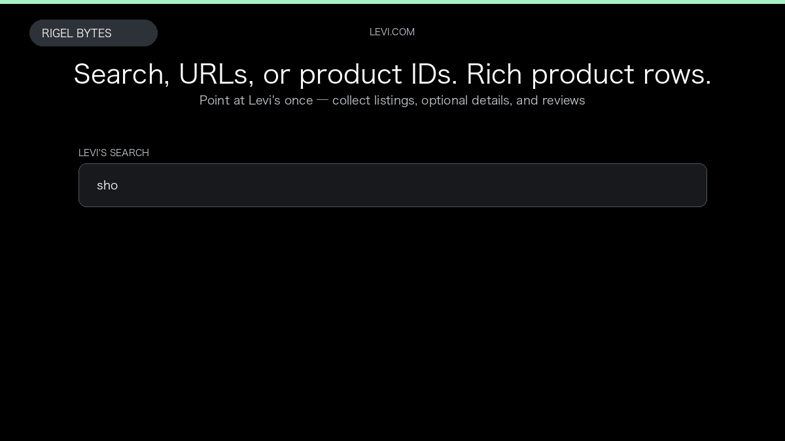

# Levi's Scraper

**Levi's Scraper** is an Apify Actor by Rigel Bytes for Levi's data.

This folder hosts the public demo GIF used on the Actor README. The scraper itself runs on Apify Store — not in this repository.

**[Levi's Scraper on Apify](https://apify.com/rigelbytes/levi-scraper)**

## What this Levi's scraper does

Scrape Levi's product listings from search, categories, or product IDs with optional sizes, stock, and Bazaarvoice reviews.

Use it as a Levi's scraper to extract structured data and export CSV, JSON, Excel, or XML from Apify.

## Start here

1. Open [Levi's Scraper](https://apify.com/rigelbytes/levi-scraper) on Apify Store.
2. Paste your Levi's URLs, queries, or other documented inputs.
3. Click **Start** and export JSON, CSV, Excel, or XML.

If you found this GitHub page while looking for a Levi's scraper, use the Apify link above to run it.
