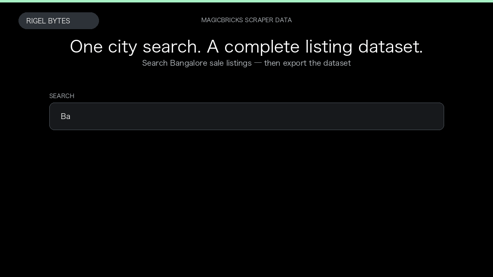

# MagicBricks Scraper

**MagicBricks Scraper** is an Apify Actor by Rigel Bytes for MagicBricks data.

This folder hosts the public demo GIF used on the Actor README. The scraper itself runs on Apify Store — not in this repository.

**[MagicBricks Scraper on Apify](https://apify.com/rigelbytes/magicbricks-scraper)**

## What this MagicBricks scraper does

Extract MagicBricks sale and rent listings — prices, BHK, locality, amenities, and optional listing extras — for Indian real-estate research and monitoring.

Use it as a MagicBricks scraper to extract structured data and export CSV, JSON, Excel, or XML from Apify.

## Start here

1. Open [MagicBricks Scraper](https://apify.com/rigelbytes/magicbricks-scraper) on Apify Store.
2. Paste your MagicBricks URLs, queries, or other documented inputs.
3. Click **Start** and export JSON, CSV, Excel, or XML.

If you found this GitHub page while looking for a MagicBricks scraper, use the Apify link above to run it.
