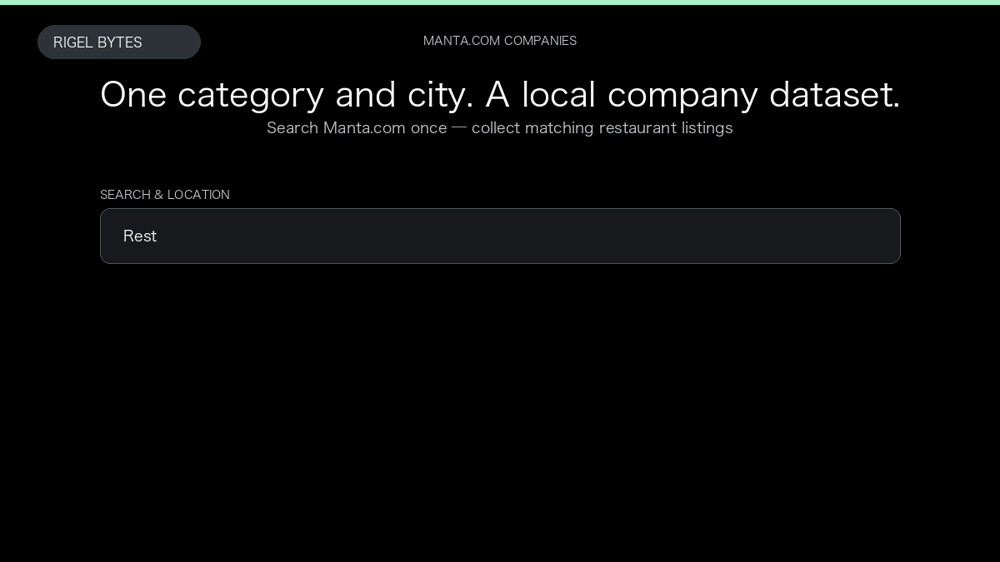

# Manta Scraper

**Manta Scraper** is an Apify Actor by Rigel Bytes for Manta.com data.

This folder hosts the public demo GIF used on the Actor README. The scraper itself runs on Apify Store — not in this repository.

**[Manta Scraper on Apify](https://apify.com/rigelbytes/manta-scraper)**

## What this Manta.com scraper does

Extract Manta.com company listings — name, phone, address, website, hours, and SIC — for local lead generation and market research.

Use it as a Manta.com scraper to extract structured data and export CSV, JSON, Excel, or XML from Apify.

## Start here

1. Open [Manta Scraper](https://apify.com/rigelbytes/manta-scraper) on Apify Store.
2. Paste your Manta.com URLs, queries, or other documented inputs.
3. Click **Start** and export JSON, CSV, Excel, or XML.

If you found this GitHub page while looking for a Manta.com scraper, use the Apify link above to run it.
