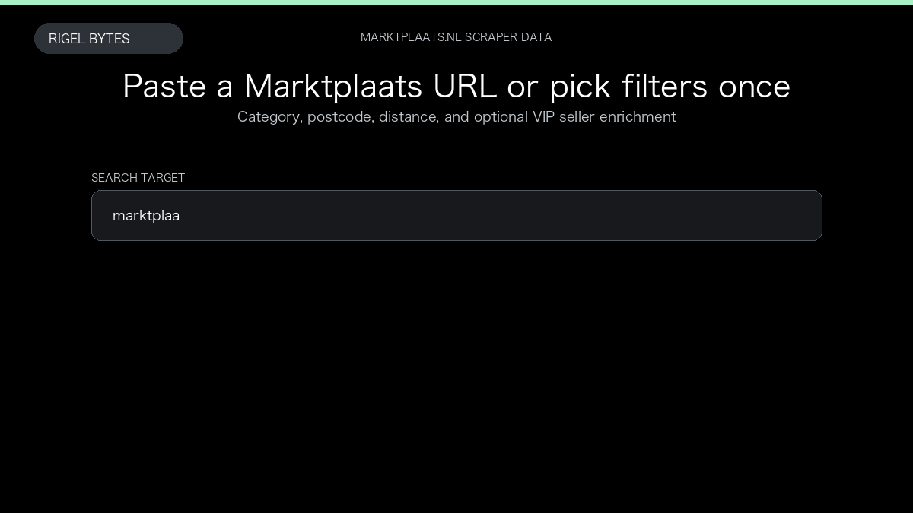

# Marktplaats.nl Scraper

**Marktplaats.nl Scraper** is an Apify Actor by Apify Actor for Marktplaats.nl data.

This folder hosts the public demo GIF used on the Actor README. The scraper itself runs on Apify Store — not in this repository.

**[Marktplaats.nl Scraper on Apify](https://apify.com/rigelbytes/marktplaats-nl-scraper)**

## What this Marktplaats.nl scraper does

Animated demo: Marktplaats.nl search input to structured listing dataset for price monitoring and lead generation.

Use it as a Marktplaats.nl scraper to extract structured data and export CSV, JSON, Excel, or XML from Apify.

## Start here

1. Open [Marktplaats.nl Scraper](https://apify.com/rigelbytes/marktplaats-nl-scraper) on Apify Store.
2. Paste your Marktplaats.nl URLs, queries, or other documented inputs.
3. Click **Start** and export JSON, CSV, Excel, or XML.

If you found this GitHub page while looking for a Marktplaats.nl scraper, use the Apify link above to run it.
