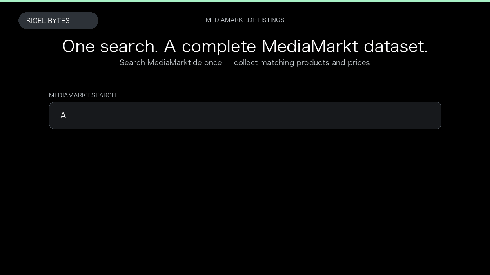

# MediaMarkt Germany Product Scraper

**MediaMarkt Germany Product Scraper** is an Apify Actor by Rigel Bytes for MediaMarkt.de data.

This folder hosts the public demo GIF used on the Actor README. The scraper itself runs on Apify Store — not in this repository.

**[MediaMarkt Germany Product Scraper on Apify](https://apify.com/rigelbytes/mediamarkt-de-scraper)**

## What this MediaMarkt.de scraper does

Scrape MediaMarkt.de product listings, prices, ratings, and reviews from search queries or URLs for price monitoring and catalog research.

Use it as a MediaMarkt.de scraper to extract structured data and export CSV, JSON, Excel, or XML from Apify.

## Start here

1. Open [MediaMarkt Germany Product Scraper](https://apify.com/rigelbytes/mediamarkt-de-scraper) on Apify Store.
2. Paste your MediaMarkt.de URLs, queries, or other documented inputs.
3. Click **Start** and export JSON, CSV, Excel, or XML.

If you found this GitHub page while looking for a MediaMarkt.de scraper, use the Apify link above to run it.
