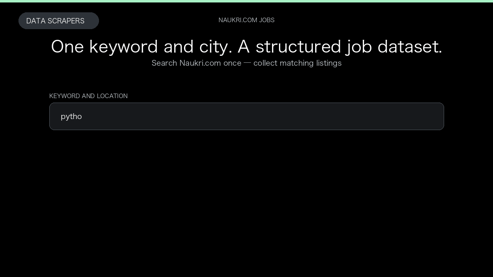

# Naukri Job Scraper

**Naukri Job Scraper** is an Apify Actor by Data Scrapers for Naukri.com data.

This folder hosts the public demo GIF used on the Actor README. The scraper itself runs on Apify Store — not in this repository.

**[Naukri Job Scraper on Apify](https://apify.com/datascrapers/naukri-scraper)**

## What this Naukri.com scraper does

Naukri.com job listings from keywords, locations, or company pages, with optional job details, company overview, and AmbitionBox reviews.

Use it as a Naukri.com scraper to extract structured data and export CSV, JSON, Excel, or XML from Apify.

## Start here

1. Open [Naukri Job Scraper](https://apify.com/datascrapers/naukri-scraper) on Apify Store.
2. Paste your Naukri.com URLs, queries, or other documented inputs.
3. Click **Start** and export JSON, CSV, Excel, or XML.

If you found this GitHub page while looking for a Naukri.com scraper, use the Apify link above to run it.
