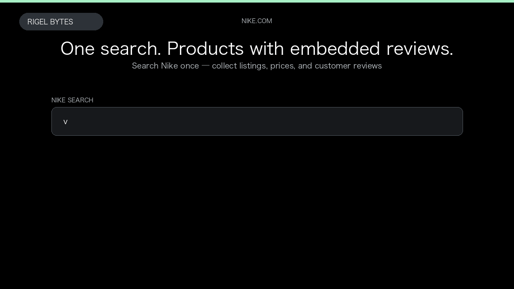

# Nike Scraper

**Nike Scraper** is an Apify Actor by Rigel Bytes for Nike.com data.

This folder hosts the public demo GIF used on the Actor README. The scraper itself runs on Apify Store — not in this repository.

**[Nike Scraper on Apify](https://apify.com/rigelbytes/nike-scraper)**

## What this Nike.com scraper does

Scrapes Nike.com product listings from search queries or category URLs, with optional product details and embedded customer reviews.

Use it as a Nike.com scraper to extract structured data and export CSV, JSON, Excel, or XML from Apify.

## Start here

1. Open [Nike Scraper](https://apify.com/rigelbytes/nike-scraper) on Apify Store.
2. Paste your Nike.com URLs, queries, or other documented inputs.
3. Click **Start** and export JSON, CSV, Excel, or XML.

If you found this GitHub page while looking for a Nike.com scraper, use the Apify link above to run it.
