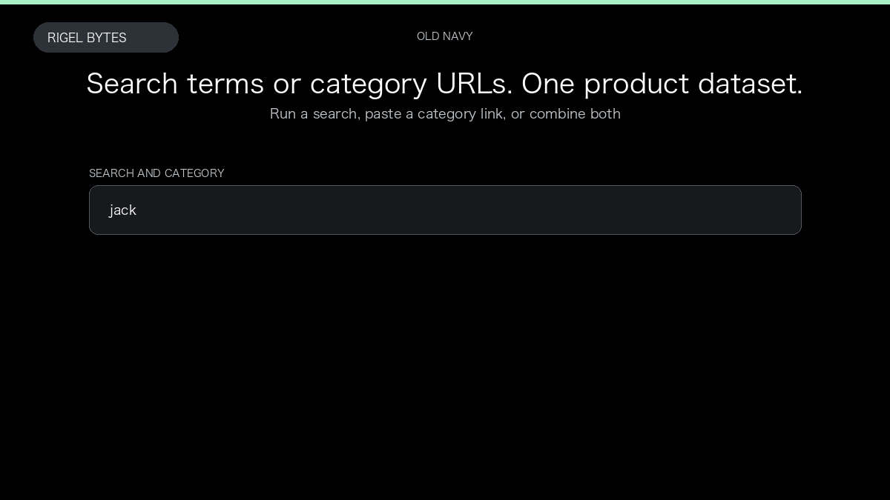

# Old Navy Scraper

**Old Navy Scraper** is an Apify Actor by Rigel Bytes for Old Navy data.

This folder hosts the public demo GIF used on the Actor README. The scraper itself runs on Apify Store — not in this repository.

**[Old Navy Scraper on Apify](https://apify.com/rigelbytes/oldnavy-gap-scraper)**

## What this Old Navy scraper does

Scrape Old Navy US product listings from search queries or category URLs, with optional product details and customer reviews. Export structured JSON, CSV, or Excel for pricing, catalog, and review research.

Use it as a Old Navy scraper to extract structured data and export CSV, JSON, Excel, or XML from Apify.

## Start here

1. Open [Old Navy Scraper](https://apify.com/rigelbytes/oldnavy-gap-scraper) on Apify Store.
2. Paste your Old Navy URLs, queries, or other documented inputs.
3. Click **Start** and export JSON, CSV, Excel, or XML.

If you found this GitHub page while looking for a Old Navy scraper, use the Apify link above to run it.
