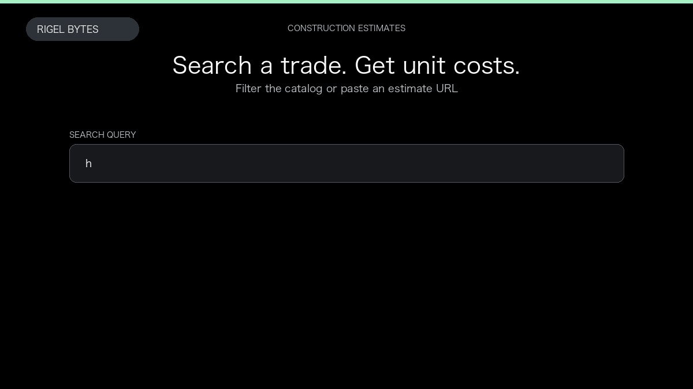

# Open Construction Estimate Scraper

**Open Construction Estimate Scraper** is an Apify Actor by Rigel Bytes for OpenConstructionEstimate data.

This folder hosts the public demo GIF used on the Actor README. The scraper itself runs on Apify Store — not in this repository.

**[Open Construction Estimate Scraper on Apify](https://apify.com/rigelbytes/openconstructionestimate-scraper)**

## What this OpenConstructionEstimate scraper does

Scrape OpenConstructionEstimate unit costs, labor hours, and resource breakdowns for construction estimating and bid research.

Use it as a OpenConstructionEstimate scraper to extract structured data and export CSV, JSON, Excel, or XML from Apify.

## Start here

1. Open [Open Construction Estimate Scraper](https://apify.com/rigelbytes/openconstructionestimate-scraper) on Apify Store.
2. Paste your OpenConstructionEstimate URLs, queries, or other documented inputs.
3. Click **Start** and export JSON, CSV, Excel, or XML.

If you found this GitHub page while looking for a OpenConstructionEstimate scraper, use the Apify link above to run it.
