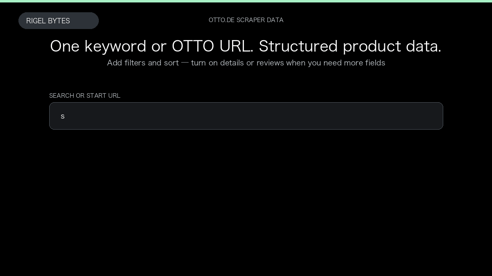

# OTTO.de Scraper

**OTTO.de Scraper** is an Apify Actor by Rigel Bytes for OTTO.de data.

This folder hosts the public demo GIF used on the Actor README. The scraper itself runs on Apify Store — not in this repository.

**[OTTO.de Scraper on Apify](https://apify.com/rigelbytes/otto-de-scraper)**

## What this OTTO.de scraper does

Scrape OTTO.de products from a search query or category URL, with optional product details and one dataset row per review.

Use it as a OTTO.de scraper to extract structured data and export CSV, JSON, Excel, or XML from Apify.

## Start here

1. Open [OTTO.de Scraper](https://apify.com/rigelbytes/otto-de-scraper) on Apify Store.
2. Paste your OTTO.de URLs, queries, or other documented inputs.
3. Click **Start** and export JSON, CSV, Excel, or XML.

If you found this GitHub page while looking for a OTTO.de scraper, use the Apify link above to run it.
