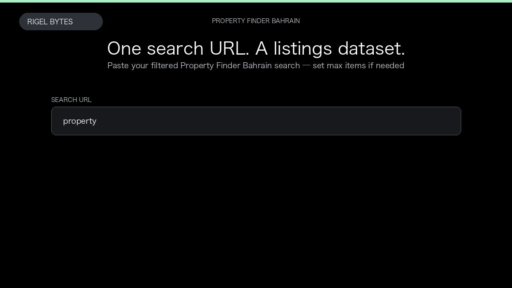

# Property Finder Bahrain Scraper

**Property Finder Bahrain Scraper** is an Apify Actor by Rigel Bytes for Property Finder Bahrain data.

This folder hosts the public demo GIF used on the Actor README. The scraper itself runs on Apify Store — not in this repository.

**[Property Finder Bahrain Scraper on Apify](https://apify.com/rigelbytes/propertyfinder-bahrain)**

## What this Property Finder Bahrain scraper does

Extract Property Finder Bahrain search results into structured listings with optional full property details and agent WhatsApp or phone contacts for market research and CRM workflows.

Use it as a Property Finder Bahrain scraper to extract structured data and export CSV, JSON, Excel, or XML from Apify.

## Start here

1. Open [Property Finder Bahrain Scraper](https://apify.com/rigelbytes/propertyfinder-bahrain) on Apify Store.
2. Paste your Property Finder Bahrain URLs, queries, or other documented inputs.
3. Click **Start** and export JSON, CSV, Excel, or XML.

If you found this GitHub page while looking for a Property Finder Bahrain scraper, use the Apify link above to run it.
