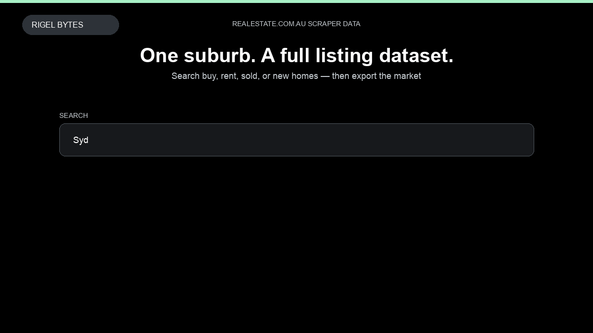

# Realestate.com.au Scraper

**Realestate.com.au Scraper** is an Apify Actor by Rigel Bytes for realestate.com.au data.

This folder hosts the public demo GIF used on the Actor README. The scraper itself runs on Apify Store — not in this repository.

**[Realestate.com.au Scraper on Apify](https://apify.com/rigelbytes/realestate-com-au-scraper)**

## What this realestate.com.au scraper does

Extract Australian property listings and agent profiles from realestate.com.au for market research, lead generation, and listing monitoring.

Use it as a realestate.com.au scraper to extract structured data and export CSV, JSON, Excel, or XML from Apify.

## Start here

1. Open [Realestate.com.au Scraper](https://apify.com/rigelbytes/realestate-com-au-scraper) on Apify Store.
2. Paste your realestate.com.au URLs, queries, or other documented inputs.
3. Click **Start** and export JSON, CSV, Excel, or XML.

If you found this GitHub page while looking for a realestate.com.au scraper, use the Apify link above to run it.
