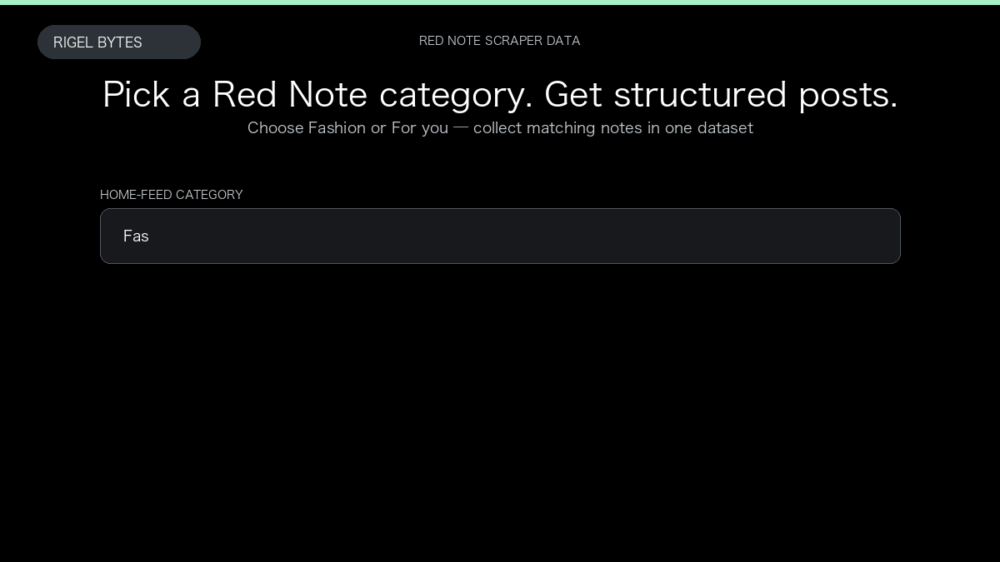

# Red Note Scraper

**Red Note Scraper** is an Apify Actor by Rigel Bytes for Red Note data.

This folder hosts the public demo GIF used on the Actor README. The scraper itself runs on Apify Store — not in this repository.

**[Red Note Scraper on Apify](https://apify.com/rigelbytes/rednote-scraper)**

## What this Red Note scraper does

Scrape Red Note (Xiaohongshu) posts, creator profiles, and comments into structured datasets for trend research and creator monitoring.

Use it as a Red Note scraper to extract structured data and export CSV, JSON, Excel, or XML from Apify.

## Start here

1. Open [Red Note Scraper](https://apify.com/rigelbytes/rednote-scraper) on Apify Store.
2. Paste your Red Note URLs, queries, or other documented inputs.
3. Click **Start** and export JSON, CSV, Excel, or XML.

If you found this GitHub page while looking for a Red Note scraper, use the Apify link above to run it.
