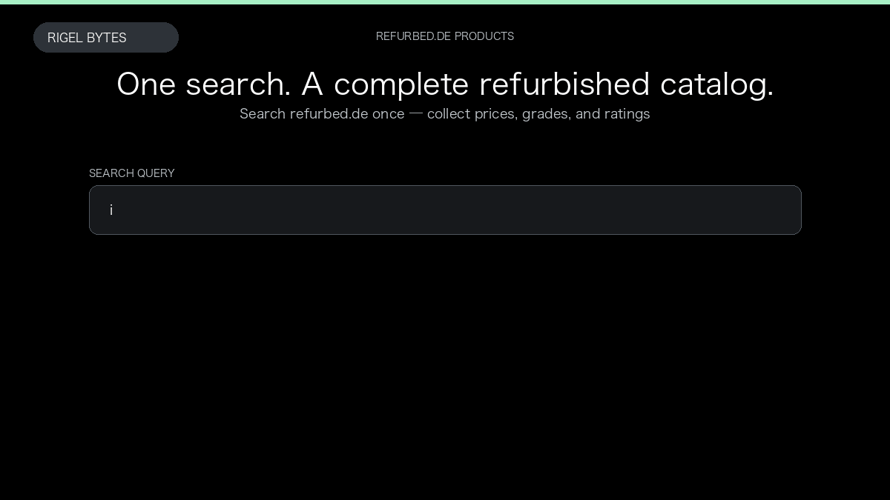

# Refurbed.de Product Scraper

**Refurbed.de Product Scraper** is an Apify Actor by Rigel Bytes for refurbed.de data.

This folder hosts the public demo GIF used on the Actor README. The scraper itself runs on Apify Store — not in this repository.

**[Refurbed.de Product Scraper on Apify](https://apify.com/rigelbytes/refurbed-de-scraper)**

## What this refurbed.de scraper does

Scrape refurbished product listings from refurbed.de using a search query or URL, then export prices, grades, brands, and ratings for monitoring and catalog research.

Use it as a refurbed.de scraper to extract structured data and export CSV, JSON, Excel, or XML from Apify.

## Start here

1. Open [Refurbed.de Product Scraper](https://apify.com/rigelbytes/refurbed-de-scraper) on Apify Store.
2. Paste your refurbed.de URLs, queries, or other documented inputs.
3. Click **Start** and export JSON, CSV, Excel, or XML.

If you found this GitHub page while looking for a refurbed.de scraper, use the Apify link above to run it.
